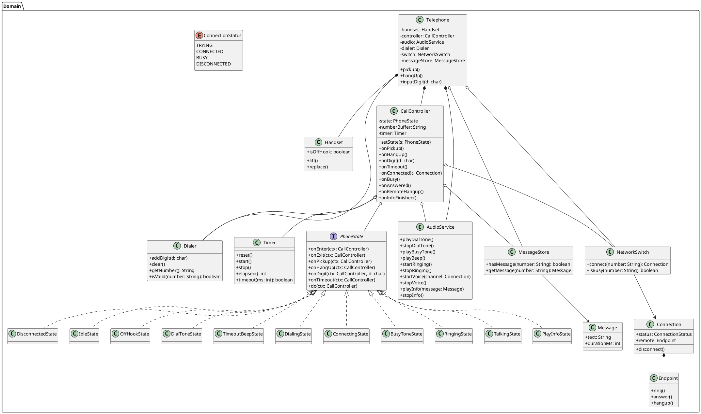

# 电话模拟软件 UML 类图设计说明

本文档给出了电话模拟软件的完整 UML 类图与设计说明。类图以状态模式为核心，围绕拨号、音频与网络交换进行协作，覆盖图片中的所有状态与转换。

## 1. 设计目标
- 将“闲置→拿起→拨号音→超时/拨号→试接通→占线/振铃→接通→通话→断线”全过程映射为可实现的对象模型。
- 用状态模式解耦各状态的行为，`CallController`统一驱动状态切换与协作。
- 保持职责单一：拨号、音频、交换机与消息存储分别独立。

## 2. 类职责概要
- `Telephone`：系统入口，接收用户动作，委派给`CallController`。
- `Handset`：听筒状态（摘机/挂机）。
- `CallController`：持有当前`PhoneState`、号码缓冲与计时器，处理事件与状态切换，协调`AudioService`与`NetworkSwitch`。
- `PhoneState`：状态接口；具体状态类一一对应图片中的节点（闲置、拨号音、超时蜂鸣、拨号、试接通、忙音、振铃、通话、播放信息、断线）。
- `Dialer`：数字输入缓冲与号码校验。
- `Timer`：拨号音超时与其它时序控制。
- `AudioService`：拨号音、忙音、蜂鸣、振铃与语音通道播放控制。
- `MessageStore`/`Message`：无效号码时的存储信息播放。
- `NetworkSwitch`：模拟交换机，返回`Connection`并报告占线/尝试/接通/断线。
- `Connection`/`Endpoint`/`ConnectionStatus`：通话连接对象、远端终端与连接状态枚举。

## 3. PlantUML 类图
将以下代码粘贴到 PlantUML 渲染器即可生成类图。

## 4. 状态与图片映射（摘要）
- `IdleState`：闲置
- `OffHookState`：拿起听筒
- `DialToneState`：拨号音（计时器置零与递增）
- `TimeoutBeepState`：超时蜂鸣音
- `DialingState`：数字输入与号码缓冲，判定有效/无效号码
- `ConnectingState`：试接通
- `BusyToneState`：占线/忙音
- `RingingState`：振铃，等待受话方回话
- `TalkingState`：通话，受话方挂断或本机挂断进入断线
- `PlayInfoState`：无效号码播放存储信息
- `DisconnectedState`：断线

## 5. 使用说明
- 复制第 3 节的 PlantUML 代码到任意 PlantUML 渲染器，即可生成类图图片。